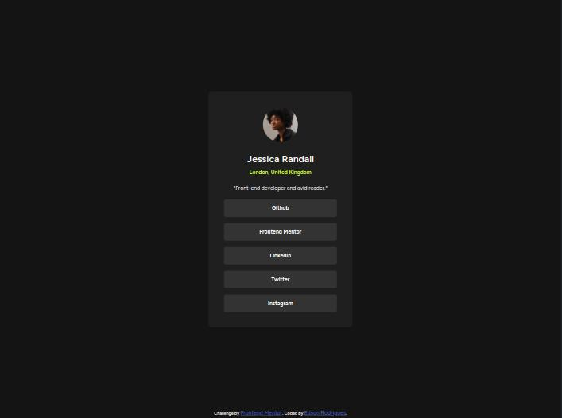

# Frontend Mentor - Social links profile solution

This is a solution to the [Social links profile challenge on Frontend Mentor](https://www.frontendmentor.io/challenges/social-links-profile-UG32l9m6dQ). Frontend Mentor challenges help you improve your coding skills by building realistic projects. 

## Table of contents

- [Overview](#overview)
  - [The challenge](#the-challenge)
  - [Screenshot](#screenshot)
  - [Links](#links)
- [My process](#my-process)
  - [Built with](#built-with)
  - [What I learned](#what-i-learned)
  - [Continued development](#continued-development)
  - [Useful resources](#useful-resources)
- [Author](#author)

## Overview

### The challenge

Users should be able to:

- See hover and focus states for all interactive elements on the page

### Screenshot



### Links

- Solution URL: [Add solution URL here](https://your-solution-url.com)
- Live Site URL: [Add live site URL here](https://social-link-profile-main-edson.netlify.app/)

## My process

### Built with

- Semantic HTML5 markup
- CSS custom properties
- Flexbox
- Mobile-first workflow

**Note: These are just examples. Delete this note and replace the list above with your own choices**

### What I learned

Base html
```html
<main class="main">
    <div class="social-card">
      <div class="social-card-picture"></div>
      <h1 class="social-card-name">
        Jessica Randall
      </h1>
      <h2 class="social-card-location">
        London, United Kingdom
      </h2>
      <p class="social-card-description">
        "Front-end developer and avid reader."
      </p>
      <ul class="social-card-list">
        <li class="social-card-item">
          <a href="#" class="social-card-link">Github</a>
        </li>
        <li class="social-card-item">
          <a href="#" class="social-card-link">Frontend Mentor</a>
        </li>
        <li class="social-card-item">
          <a href="#" class="social-card-link">Linkedin</a>
        </li>
        <li class="social-card-item">
          <a href="#" class="social-card-link">Twitter</a>
        </li>
        <li class="social-card-item">
          <a href="#" class="social-card-link">Instagram</a>
        </li>
      </ul>
    </div>
  </main>
```
This makes the whole list item area clickable
```css
.social-card-link {
  text-decoration: none;
  color: white;
  font-weight: 700;
  display: block;
  height: 100%;
  align-content: center;
}
```

### Continued development

Better use of CSS for dynamic content.

### Useful resources

- [W3W: CSS display Property](https://www.w3schools.com/cssref/pr_class_display.php)
- [CSS-Tricks: display](https://css-tricks.com/almanac/properties/d/display/)

## Author

- Frontend Mentor - [@rodriguesedson](https://www.frontendmentor.io/profile/rodriguesedson)
- Xwitter - [@rodrigues.edson](https://x.com/edson_rodr1gu3s)
